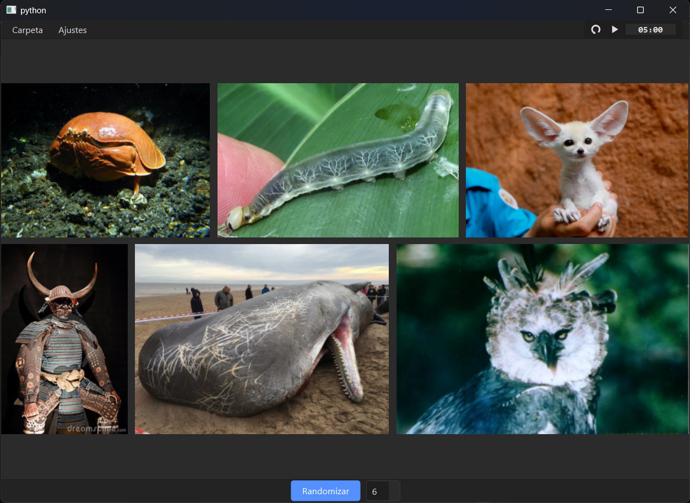
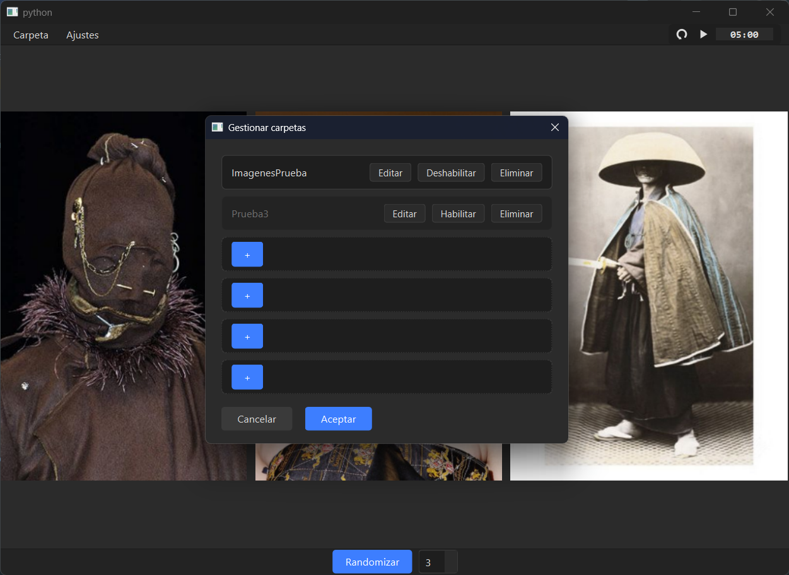

# Image Randomizer FA

> A desktop visual-reference tool for artists and character designers. It builds a random, responsive collage from your selected image sources, helping you discover unexpected combinations for drawing and design sessions.

[Download the latest Windows release](../../releases/latest)

## Overview

Image Randomizer FA is a Windows desktop application built with Python and PySide6. It brings visual-reference images together into one shared pool, then selects a fresh set at random and presents it in a responsive justified layout.

The project is designed for personal creative workflows: collecting references for characters, creatures, props, architecture, animals, or environments, then quickly generating combinations that can inspire a new drawing or design direction.

The interface is available in both **English** and **Spanish**.

## Features

- Combine multiple local image folders into one unified source pool.
- Give every image the same probability of being selected, regardless of which source folder it belongs to.
- Generate a new full set of random references with one action.
- Replace one individual reference without changing the rest of the collage.
- View any reference in a focused zoom overlay, with background blur and keyboard/mouse dismissal.
- Display references in a responsive justified layout: images retain their aspect ratio and are never cropped or distorted.
- Configure up to six local source folders from the interface.
- Enable, disable, rename, edit, or remove configured source folders.
- Persist folder configuration and language preference locally between sessions.
- Use an optional configurable countdown timer for timed drawing or design exercises.
- Switch the complete interface between English and Spanish without restarting the application.
- Run as a standalone Windows executable; Python is not required for end users.

## Folder sources

The folder manager keeps reference sources configurable from the UI rather than hard-coding file-system paths. Changes are reviewed in the dialog and applied only when the user confirms them.

Each configured folder can be enabled or disabled independently. Enabled folders contribute their images to the same unified pool, so a large folder does not receive special priority over a small one: selection is performed per image, not per folder.

## How it works

### Unified random pool

The application reads supported images from active local folders and combines their file paths into a single pool. A random sample is then chosen without duplicates for the current collage. This makes the selection behaviour predictable and fair across all active sources.

### Responsive justified layout

Rather than using a fixed-cell grid, Image Randomizer FA uses a custom justified-layout algorithm written in Python. It groups images into rows and calculates their dimensions so that every row uses the available width while preserving each image’s original aspect ratio.

The result is a compact reference board that adapts when the application window is resized, without cropping or stretching the images.

### Clear separation of responsibilities

The codebase separates application logic from graphical-interface code:

- `core/` contains the image-pool logic, layout calculations, timer state, folder persistence, and language management.
- `ui/` contains PySide6 widgets, dialogs, overlays, visual styling, and user interaction.
- `i18n/` contains the English and Spanish translation dictionaries.

This separation keeps the non-visual logic easier to reason about and test independently of the interface.

### Local configuration

Folder configuration and the selected language are stored locally in JSON files. They are application settings, not reference-image copies: image files remain in their original folders.

## Pinterest API use case

The next and only planned development step is a Pinterest integration that will extend the same reference workflow to a user’s own Pinterest content.

The goal is not to scrape public Pinterest pages or download collections into the repository. Instead, the application will allow each user to connect their own Pinterest account through OAuth and select boards that the authenticated account is authorized to access.

Planned behavior:

- Pinterest boards will become another selectable source alongside local folders.
- Board and Pin data will be requested from the Pinterest API for the active session.
- Selected Pins will enter the same unified random pool as local references.
- Image bytes will be loaded asynchronously only when a Pin is selected for a collage tile, keeping the interface responsive.
- Board lists, Pin metadata, image URLs, and decoded images will exist only in memory for the duration of the session.
- Pinterest API data will not be saved to disk or committed to the repository.
- OAuth access and refresh tokens will be stored locally by the user, excluded through `.gitignore`, and never committed.

This architecture is intentionally designed around authorized access and Pinterest’s API data-storage requirements while preserving the app’s main purpose: rapid discovery of visual reference combinations.

## Download and run

1. Open the [latest release](../../releases/latest).
2. Download `Image-Randomizer-FA.exe` from the release assets.
3. Run the executable.
4. Open the folder manager and add your own local image folders.
5. Select **Randomize** to generate a new reference set.

The Windows executable is distributed as a standalone application. No Python installation, virtual environment, or manual dependency installation is required to run it.

## Technologies

- Python
- PySide6 / Qt
- PyInstaller
- JSON for local settings and translations
- GitHub Releases for Windows distribution

## Project status

The current release includes the local-folder workflow, responsive collage, zoom overlay, configurable timer, folder management, and English/Spanish interface.

The next development phase is the Pinterest OAuth and board-integration workflow described above.

## Privacy and security

- Local reference images are read from folders chosen by the user.
- OAuth tokens and any development secrets are local-only and excluded from version control.
- No Pinterest credentials, tokens, or API-derived content are included in this repository.
- Pinterest integration will access accounts only after the account owner authorizes the application.
